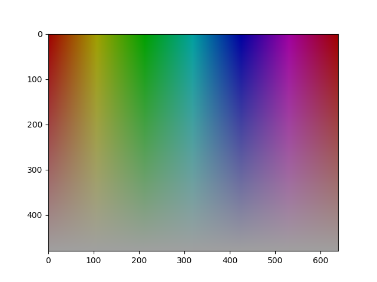
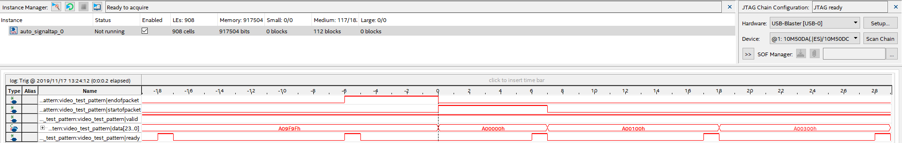
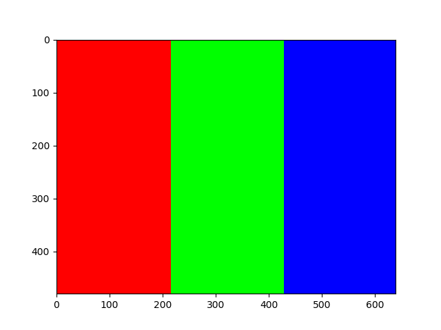
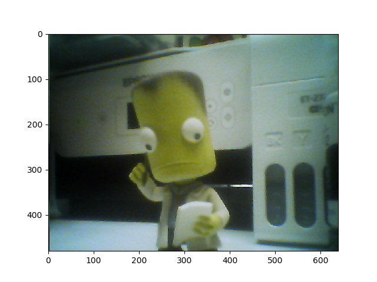

# (11/17/2019) Testing PIO Camera to NIOS II

## PIO Camera Read Attempt

I injected a counter signal into the data stream in the last byte.  A sample is shown below.  It seems we are unable to keep up with the
camera as the counter is going up by ~16 each time.  [0x00, 0x10, 0x23 0x3E, 0x51, 0x68]

53A500 252D10 262B23 27283E 2A2B51 292F68 353A84 515594 3333A8 758DC3 D3F5DA D1F6ED 6BAC04 6EAE1B 89C832 73BD40 262D4C 26295F 233072 242B89
2B2DA0 3033AF 3036C2 5256D5 2E35E8 565AFC D0F210 D4F627 95CD3A 4F7051 99CE64 70BE7F 2A2E90 252EA3 282FB6 282DCA 2A2CE1 2936F4 393904 3A481B
323626 4D5239 C2E048 D5F558 D4F568 95C87C 4C6F8C 88CA9C 8CCBB0 71BFC0 212DCD 2330DD 242EF1 262F01 292D11 2C2E25 303638 373D47 4D4F5B 34386A
678481 CFF491 D8F5A1 ADD6B5 4884C5 4B75D5 97CEE5 81C5F9 272B12 233025 282935 2A2B45 2C2D55 283269 2D3575 45478E 2D2DA5 545ABC D3F5CF 95C7FB

Perhapse we need to use optimization to get the processor to run fast enough, though it appears we are a few orders of magnitude away from that working and this is not the right approach.

## Video DMA IP Block

Changing tactics using University Program video core IP.  Trying Video DMA Controller.  First pass feeding with Test Generator.

To get BSP to build had to comment out line 87 of altera_up_avalon_video_dma_controller.tcl as it referenced a *_rgb.h which does not exist.

NIOS-II would not initalize with the DMA Controller slave attached.  This was determined to be due to the pixel clock driving the clock input.  The system complains if I export the streaming interface without using an exported clock, so I am not sure how to connect this to my camera module.  Do I need to make a custom IP block to interface with my camera?  Attemped using the test pattern generator in combination with the block and got the correct result shown in the image below.

## Understanding the Avalon Streaming Interface

Now that we know this configuration works we can look at the Avalon streaming interface to figure out how it works.  I inserted a Signal Tap onto the interface lines to see how it behaves.  The capture is shown below.  It is centered around the begining/end of the frame since thats where all the signals are changing at the same time.  In this case we can see the valid signal is always high, thats because the generation block is guaranteed to always be ready.  The interface is purely driven by back pressure.  When the camera is driving it will be the time determining factor.  Hopefully we wil not need a FIFO, as I would like not to have to deal with backpressure.  The ready signal pulses high whenever the DMA block is able to sen danother byte.  We will need to drop valid low after the DMA block grabs our next value until we are ready to send another (i.e. got it from the camera).  The start and end signals are just pulsed high when the first and last pixels are valid respectivly.  Should be easy to replicate.  Effectivly just a reset on the buffer position.

## Emulating Streaming Interface with Colorbar Test

To insure that we can drive the interface form outside the streaming interface was exported and a color bar generator was written in verilog modled after the TPG from altera.  The QSYS HDL Generation worked without issues.  The system clock and reset had to be brought out with bridges to connect to the custom block.  Everything worked and the pattern below was pulled from memory.

Next step is to actually create the camera block that implements the steaming interface.  There are 3 challenges here.  We may need a FIFO if the streaming interface lags sometimes.  We will need to implement the VALID signal for when the steaming interface is ready but we are still waiting on the camera.  We are crossing the camera pixel clock and sysclock domains.  A FIFO would solve the clock domain issue killing to birds with one stone.  Implement a small circular buffer.  Will need to cross over the start/end status as well.  We can use a 32-bit FIFO and use the unused upper 8 bits for control information.  Use a small block RAM.

Got an image coming through.  Fixed a few issues.  The FIFO needs negative edge on the CPU side.  This may be messing with the other logic.  The YUV to RGB decoding was not taking into account overflow of the signed math conversion so I added a state for that.  Some of the second pixel conversions where doing compares against the first pixel data.  The remaining problems are occationaly we will miss a pixel lock and get off by one and end with UY and VY flipped.  The pixel clock in general has a very confusing pattern that makes no sense.  Perhaps our output clock is flawed in some way or I've damaged the board.  Should check the clock volatage and make sure its in spec for the camera.  We are also getting more pixels than we should output sometimes, this offsets the lower image rows to the right.  Need to double check the EOP to make sure its consistently in the correct spot, that will tell if it is happening before or after the FIFO.

Final figured out problem.  The altpll generating the XVCLK for the camera had its input frequency set at 100MHz but it was being driven by a 50MHz clock.  This was causing all the problems above.  See good result below.

I set up a KISS interface on the JTAG UART.  This allows sending of log messages as well as images over the UART without idiotic printfing memory.  A raw image download only takes 30 seconds.  We are also now using the buffer swap in the DMA controller instead of just disabling the DMA controller.  This allows continus frames and give us time to work with the image.

A JPEG encoder was added but its running extremely slowly.  Probably because there is no hardware multipler and this uses floating point math.  Need to find a better embedded JPEG encoder library.  Worked though.
